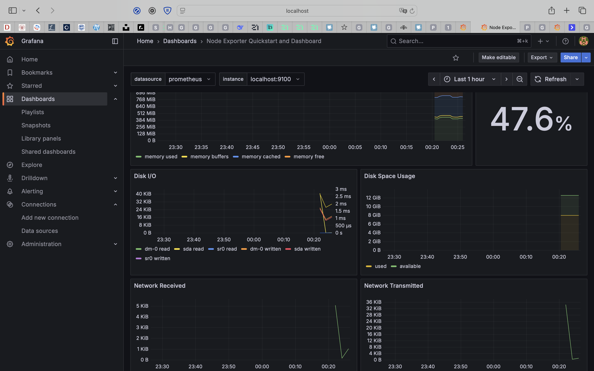
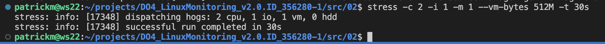
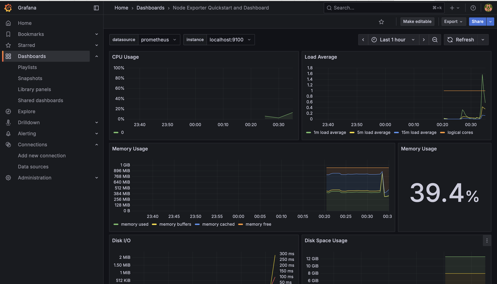
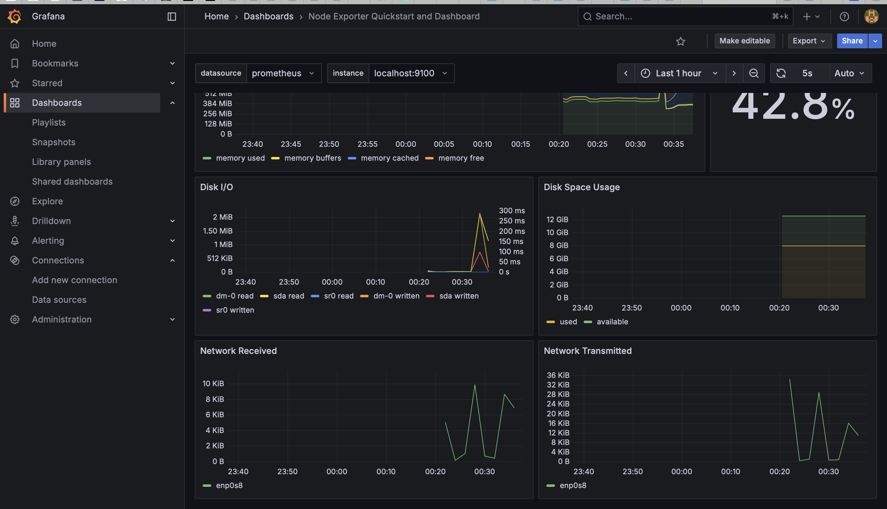
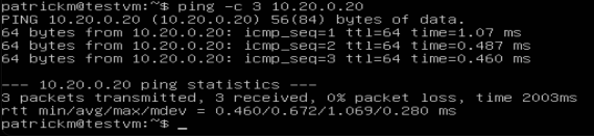
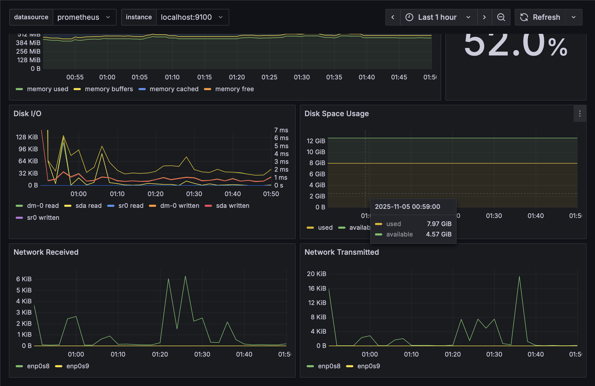
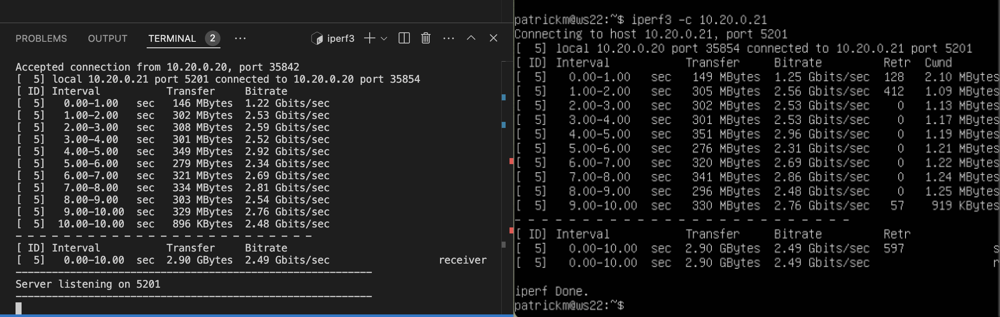
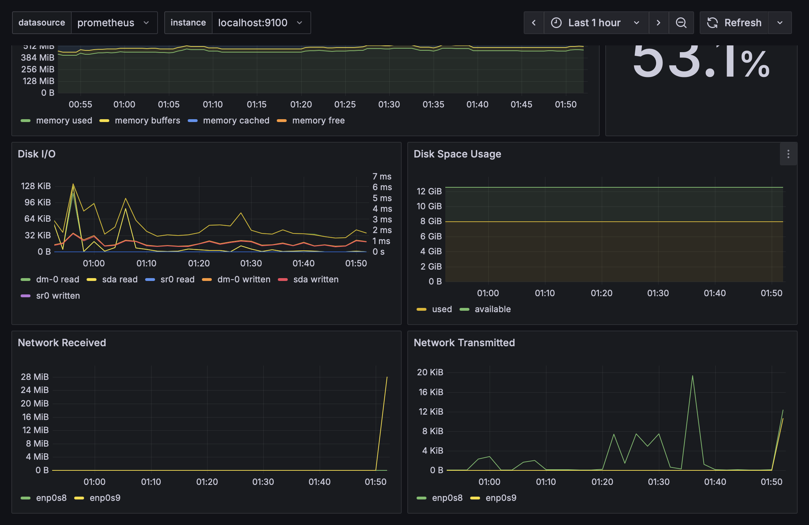

- Готовый дашборд с названием Node Exporter Quickstart and Dashboard имеет PID 13978


- ```работа импортированного дашборда```<br>
    

- ```работа импортированного дашборда 2```<br>
    

- ```Запускаем повторное тестирование```<br>
    

- ```Видим работу тестирования в метриках```<br>
    

- ```Видим работу тестирования в метриках 2```<br>
    

- Теперь запустим 2 ВМ - testvm и wm22
- testvm пропишим адрес 10.20.0.21 и пропингуем адрес wm22
- ```ws22 пингуется с testvm - ВМ в одной локальной сети```<br>
    

- ```Фиксируем состояние сетей до iperf```<br>
    

- ```Запускаем iperf3 на testvm и ws22```<br>
    

- ```Фиксируем состояние после - видны изменения enp0s9 - епредача по локальной сети между ВМ```<br>
    